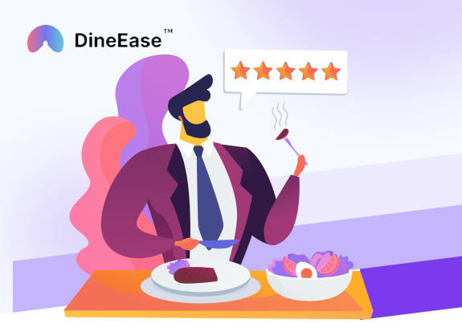

# DineEase Showcase Website

**EuroSkills Herning 2025 Hungarian National Competition, Web Development - Round 1** 

Submitted by: [Skills IT](https://skillsit.hu)

## Introduction:

**DineEase**, a small startup based in Hungary, initially made waves in the restaurant industry with their innovative restaurant software. Now, they are expanding their horizons with a brand new service that aims to revolutionize how people discover, explore, and engage with restaurants. In the DineEase all-in-one portal visitors can choose between restaurants, view the full menu of any restaurant, read reviews from previous guests about the restaurant service and food. They can also book a table at the restaurant of their choice and order and pay through the website or the app.

You used to work as a freelance web developer, but now you've applied for a job as a developer at DineEase. The company's management wants to test your skills, so as part of the recruitment process, they asked you to develop the prototype of their new service.

In this round you will create an immersive and visually appealing website for DineEase dining platform. The website's primary goal is to attract new users and showcase the unique features and offerings of the DineEase service. You will demonstrate your HTML, CSS and JavaScript skills to craft a captivating website that adheres to accessibility standards and implements SEO best practices. You should pay close attention to user experience (UX) by ensuring intuitive navigation, clear call-to-action buttons, and seamless interactions throughout the website.

**DineEase expects the development to be carried out in 3 phases. In order for your submission to be evaluated, you must complete at least the first phase. You can further increase your chances of reaching the next round by meeting the requirements of the second phase in full or in part. Only start the third (optional) phase once you have completed the first two phases in full.**

### Understanding and implementing the DineEase's Vision: 
You should thoroughly review the provided website structure and detailed pages and sections defined by the management for the DineEase showcase website. You should ensure that the design of all subpages is visually aligned, creating a cohesive and harmonious user experience. Consistency in layout, typography, and color schemes is key to reinforcing the DineEase brand identity. For creating an engaging user interface that encourages visitors to explore the DineEase platform a graphic designer already created a website design. You should follow the provided design file as much as possible. The design files, images and text content can be found in the `assets` folder.

### 1. DineEase Showcase Website Structure and Pages Definition

DineEase envisions a captivating showcase website that highlights the essence of their platform, encouraging users to explore the exciting world of dining possibilities. The website structure, detailed pages and section definitions are described bellow. The text content of each page can be found in the `assets/content` folder.

#### Home Page (Phase 1 / Phase 2):
The Home Page should consist of the following sections:
* Welcoming and visually engaging hero section with an enticing call-to-action to explore restaurants. (Phase 1)
* A featured section showcasing top-rated restaurants, complete with images, brief descriptions, and ratings. For this, you should fetch the top-rated restaurants provided in the following API endpoint: `https://es2025-s17-hu-r1-backend.onrender.com/api/v1/restaurants/top-rated`. Carefully review the returned JSON and display the content on the web page. If you cannot fetch the restaurants, you can use  [`assets/data/top-rated-restauransts.json`](assets/data/top-rated-restauransts.json) which contains the same data.
**Note:** You may experience some delay when retrieving the data for the first time as our backend has limited resources.
* Testimonials from satisfied guests, sharing their delightful dining experiences through DineEase. (Phase 1)
* An interactive search bar
    * Allowing users to discover restaurants by cuisine, location, or specific preferences. You only need to implement the design, the search bar does not need to be functional. (Phase 1)
    * The user should be able to switch between simple and advanced search modes (see: "design/Restaurant Search Flow.png") **You can only use HTML and CSS for this task, JavaScript is not allowed!** (Phase 2)
* Below the interactive search bar, there are the restaurant displayed. To access the restaurant data, you can use the following API endpoint: `https://es2025-s17-hu-r1-backend.onrender.com/api/v1/restaurants`. You should display the restaurants in random order. Initially, only the first 3 restaurants are displayed along with a 'Show more' button. Clicking this button reveals the other restaurants. If you cannot fetch the restaurants, you can use  [`assets/data/restauransts.json`](assets/data/restauransts.json) which contains the same data.
* Footer section with essential links, contact information, and social media integration. (Phase 1)

#### About Us Page (Phase 2):
An overview of DineEase's mission, vision, and commitment to revolutionizing the dining experience.
A captivating timeline showcasing the journey of DineEase from its inception to becoming a culinary leader.
Profiles of the passionate team behind DineEase, featuring their expertise and dedication to the platform's success.

#### Contact Page (Phase 2):
A user-friendly contact form allowing users to get in touch with DineEase for inquiries or feedback.
Essential contact information, including email addresses and phone numbers, for prompt communication.
Links to DineEase's social media profiles, enabling users to stay connected and informed about the latest updates.

#### Privacy Policy Page (Phase 1):
Transparent disclosure of DineEase's privacy policy, emphasizing data protection and user confidentiality.

### 3. Responsive Design (Phase 2): 
You should implement responsive design techniques to ensure that the DineEase website looks visually appealing and functions flawlessly across two different viewports: mobile and desktop. Media queries and flexible layouts will be utilized to achieve responsiveness.

### 4. Accessibility Compliance (Phase 2): 
You should meticulously apply accessibility standards (WCAG) to ensure that the website is inclusive and can be used by all users, regardless of their abilities. This will involve providing alternative text for images, semantic HTML elements, and proper ARIA attributes.

### 5. SEO Best Practices (Phase 2): 
Participants will incorporate SEO best practices into the website's HTML structure, meta tags, and content, optimizing it for search engine visibility and ranking. This will increase DineEase's online presence and attract organic traffic.

### 6. Restaurant Card Web Component (Phase 3): 
The full-featured DineEase platform is expected to be built using multiple JavaScript frameworks. The platform will have restaurant display cards at its core, and it was decided that a fully compatible web component would be developed to implement this. 
- In this exciting challenge, you will have the opportunity to showcase your expertise in creating a custom web component using pure, unadulterated JavaScript. The task is designed to evaluate your ability to work with the DOM, understand the principles of encapsulation and reusability, and craft elegant, functional web components.
- You can find a foundational code structure that includes the basic HTML, CSS, and some starter JavaScript in the [`assets/web-component`](assets/web-component) folder. Your mission is to design and implement a web component that fulfills a designated functionality.
- You need to create one component: `restaurant-card`. This component will have the following props:
    - `id: number`
    - `layout: vertical | horizontal`
    - `title: string`
    - `imageSrc: string (image from unsplash)`
    - `description: string (slot)`
- You can find the design of this component here: [`assets/web-component/Web Components Desgin.png`](<assets/web-component/Web Components Desgin.png>).
- You must also implement a custom event handler. In the future, when others want to use your component, they can add an event listener to this component to react when the `Continue` button is clicked. The event listener will be used like this: `card.addEventListener("select", () => {})`
- You should submit your solution in the `/web-component` folder of your repo. 

## Assets
Some media, icons and text have been provided for you in the media files. You are free to use these, but you can also create your own, as long as the website is still fit for the design. You should not use any other media files (e.g. downloaded videos, images, icons, etc.).

## CSS Preprocessors: 
If desired, competitors may utilize CSS preprocessors such as Sass or Less to streamline their CSS workflow and enhance code maintainability. However, they must ensure that the generated CSS code passes W3C validations.

## Library, Framework, and NPM Module Limitations: 
* You are allowed to use only the following Javascript frameworks: React, Angular, Vue.
* If you choose to use either framework, create the project using one of the following commands (instead of `name-of-your-project`, use the project name of your choice or your repo name: `es2025-s17-r1-YYY`):
    * React: `npm vite@latest name-of-your-project -- --template react`
    * Vue: `npm vite@latest name-of-your-project -- --template vue`
    * Angular: `ng new name-of-your-project` (Angular CLI)
* You may use these frameworks with Typescript (e.g. `npm vite@latest your-app -- --template react-ts` )
* You are not allowed to use any other JS or CSS frameworks or libs (e.g Next.js, Bootstrap, Tailwind etc.)
* You can use npm modules which installed by the default project generation process of the selected JS framework (see above). To use of any additional npm module in your JS framework project is also forbidden with the following exceptions:
    * `react-router-dom` (`npm install react-router-dom`)
    * `vue-router` (`npm install vue-router@4`)

## Clean Code
Clean code is also important considerations. 
* **Comments**: Provide the necessary amount of comments in your HTML, CSS and JS files.
* **Semantic Elements**: Please use semantic elements in HTML files wherever possible.
* **Consistent Naming**: Use meaningful, descriptive names following a consistent style, like camelCase for JavaScript or kebab-case for CSS.
* **Modularity and Reusability**: Break code into reusable modules or components to reduce redundancy and ease maintenance.
* **Smart Framework Use**: Efficiently utilize frameworks and libraries to write concise, effective code, avoiding unnecessary dependencies.

## Validation
The website will thoroughly test on the latest stable versions of Google Chrome and Firefox. W3C also will be used  to check for HTML and CSS validity. Axe browser extension will be used for accessibility testing.

